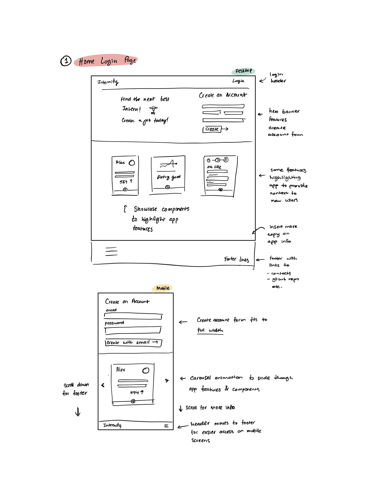
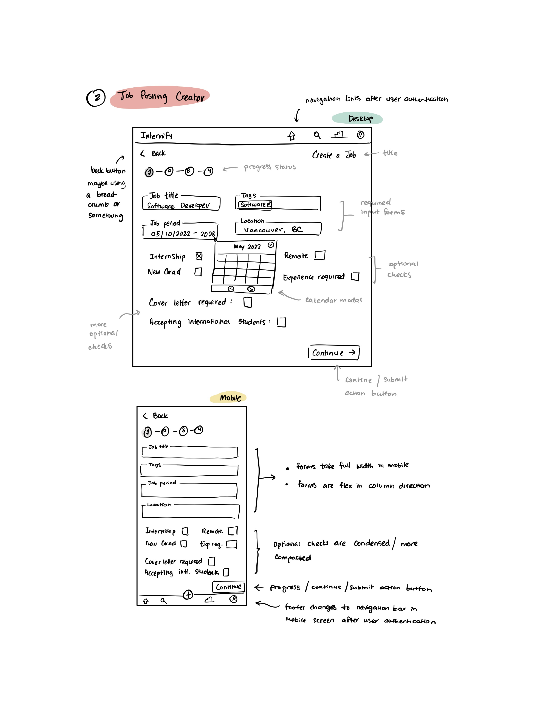
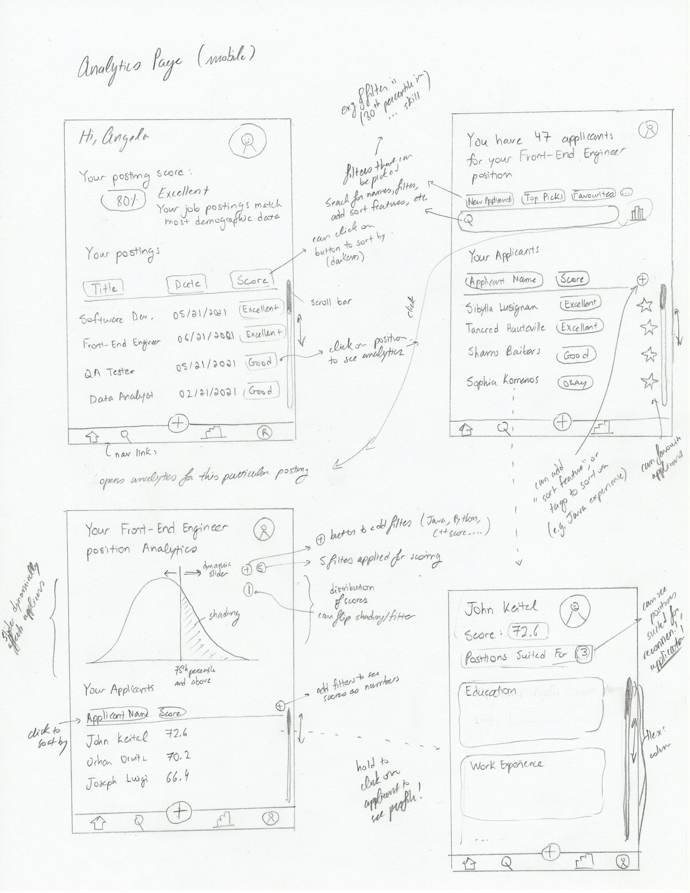

# Internify — A CPSC 455 Project

### Project Description

**Internify** is a platform that guides recruiters on building the ideal job posting for interns. One of the key features of this platform is that it provides feedback to recruiters on job requirements based on data collected from the applicant pool. The platform stores demographic data (i.e. mock data of technical skills and job experience, job-market information, and recruiter login profiles); the number of matching students with regards to job requirements, such as experience with a technology or GPA, informs recruiters on how coherent or otherwise realistic their job posting requirements are. Additional functionality includes providing recruiters with the option to use pre-filled templates for job posts, categorized by technical roles (such as backend developer, front end developer, etc), which can be further tailored by the recruiter to meet their specific needs.

### Minimal Requirements

_Task requirements that will **definitely** complete_

1. Create mock student profiles that simulate demographic data
   1. Research industry standards for front-end/back-end job requirements for interns to gather accurate demographic data
      - Define ‘standards’ for the purposes of our needs (commonalities in job postings/student experiences)
      - Record research findings
   2. Generate and distribute survey to UBC students to gather accurate demographic data
      - Create a Google Form/Survey Monkey
      - Generate appropriate questions to gather technology-stack experience
   3. Open a hosted database server and store Student models
      - I.e. technology stack experience along with length of experience (eg. Java, 4 months)
      - Create Gaussian distribution using random number generator to create mock coding test scores
2. Create authenticated login for recruiters

   1. Select and implement third party authentication platform to host and authenticate user login (i.e. Firebase)
   2. Implement create-account forms for users to create an account
3. Create job-posting creator

   1. Design the user experience flow for how users will be creating a job posting
   2. Design the user interface for how users will be creating job posting which will include but are not limited to:
      - Component hover/active/focus states
      - Arrangement of input forms, location of buttons
   3. Implement final UI-designs
4. Create guiding algorithm between mock data and job posting inputs

### Standard Requirements

_Task requirements that will **most likely** complete_

1. Create dashboard to show gaussian distribution (this is just a feature of a general graphical feature → being able to see details of applicants)

2. Create a ‘Home’ dashboard to see all job postings from all other recruiters
3. Create a ‘job posting summary page’ that showcases how well job matches demographic data
4. Create a matching algorithm that will score mock applicant users to job postings

### Stretch Requirements

_Task requirements that we plan to have **at least 1** complete_

1. Add ‘seeker’/’student’ user type for users who want to use the platform to search for jobs
2. Allow applicants who use the platform to apply for jobs via job postings
3. Allow creation of student profiles so that recruiters can search for students
