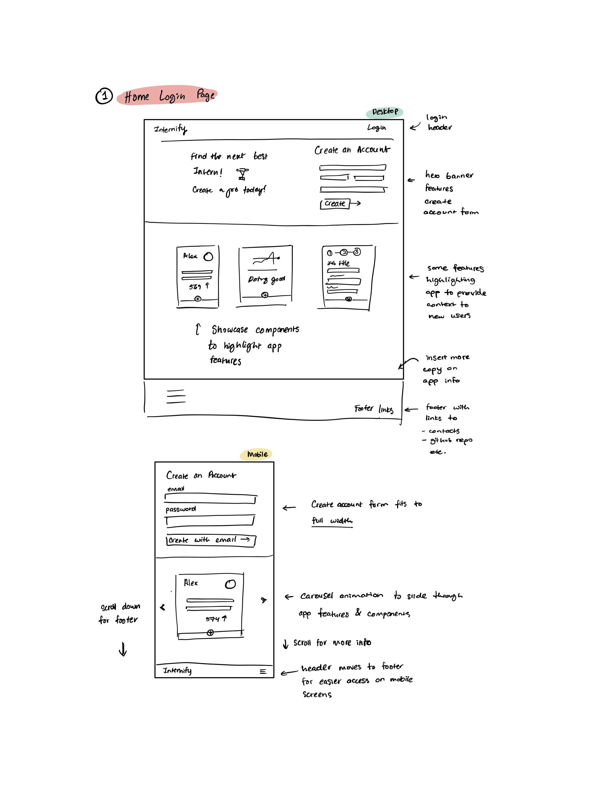
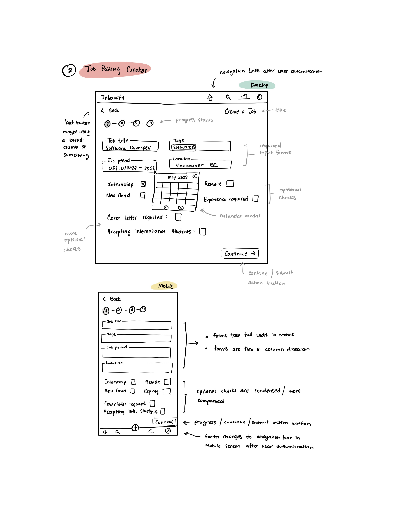
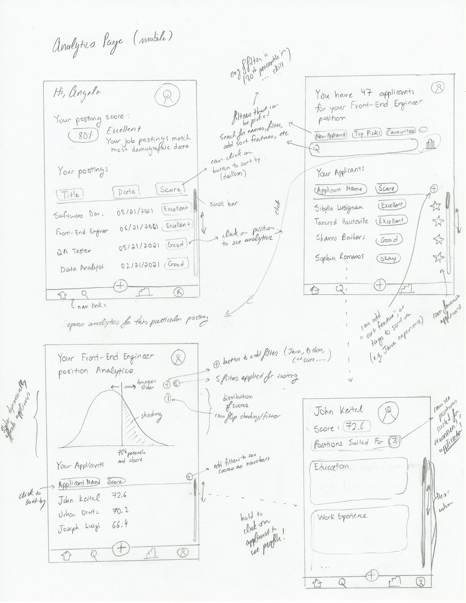

# Internify — A CPSC 455 Project

<!-- @import "[TOC]" {cmd="toc" depthFrom=1 depthTo=6 orderedList=false} -->

<!-- code_chunk_output -->

- [Internify — A CPSC 455 Project](#internify-a-cpsc-455-project)
    - [Project Description](#project-description)
    - [Minimal Requirements](#minimal-requirements)
    - [Standard Requirements](#standard-requirements)
    - [Stretch Requirements](#stretch-requirements)
    - [Technologies Used](#technologies-used)
      - [Unit 1 - HTML, CSS, and JS](#unit-1-html-css-and-js)
      - [Unit 2 - React](#unit-2-react)
      - [Unit 3 - Node and Express](#unit-3-node-and-express)
      - [Unit 4 - NoSQL with MongoDB](#unit-4-nosql-with-mongodb)
      - [Unit 5 - Release Engineering (Continuous Integration)](#unit-5-release-engineering-continuous-integration)
    - [Above and Beyond Functionality](#above-and-beyond-functionality)
    - [Next Steps](#next-steps)
    - [List of Contributions](#list-of-contributions)

<!-- /code_chunk_output -->

### Project Description

Internify is a job-posting creation tool that helps recruiters build the ideal job description for workers in tech. The tool stores demographic data via survey results and assesses your job posting dynamically as you are creating it, providing detailed summary on how well your post performs against our matching algorithm. Internify assists in creating accurate and detail-oriented job descriptions to help recruiters reach their ideal candidate.

### Minimal Requirements

_Task requirements that will **definitely** complete_

1. Create mock student profiles that simulate demographic data ✅
   1. Research industry standards for front-end/back-end job requirements for interns to gather accurate demographic data
      - Define ‘standards’ for the purposes of our needs (commonalities in job postings/student experiences)
      - Record research findings
   2. Generate and distribute survey to UBC students to gather accurate demographic data
      - Create a Google Form/Survey Monkey
      - Generate appropriate questions to gather technology-stack experience
   3. Open a hosted database server and store Student models
      - I.e. technology stack experience along with length of experience (eg. Java, 4 months)
      - Create Gaussian distribution using random number generator to create mock coding test scores
2. Create authenticated login for recruiters ✅

   1. Select and implement third party authentication platform to host and authenticate user login (i.e. Firebase)
   2. Implement create-account forms for users to create an account
3. Create job-posting creator ✅

   1. Design the user experience flow for how users will be creating a job posting
   2. Design the user interface for how users will be creating job posting which will include but are not limited to:
      - Component hover/active/focus states
      - Arrangement of input forms, location of buttons
   3. Implement final UI-designs
4. Create guiding algorithm between mock data and job posting inputs

### Standard Requirements

_Task requirements that will **most likely** complete_

1. Create dashboard to show gaussian distribution (this is just a feature of a general graphical feature → being able to see details of applicants) ❌

2. Create a ‘Home’ dashboard to see all job postings from all other recruiters ✅
3. Create a ‘job posting summary page’ that showcases how well job matches demographic data ✅
4. Create a matching algorithm that will score mock applicant users to job postings ✅

### Stretch Requirements

_Task requirements that we plan to have **at least 1** complete_
Update: Stretch requirements were updated to better orient the app towards serving the users who will be using the app to make job postings rather than to search and apply for jobs.

1. ~~Add ‘seeker’/’student’ user type for users who want to use the platform to search for jobs~~
2. ~~Allow applicants who use the platform to apply for jobs via job postings~~
3. ~~Allow creation of student profiles so that recruiters can search for students~~
4. Feature prefilled job templates for users to select so that they are able to quickly make a job posting ✅
5. Allow users to share job postings ✅
6. Allow users to export job postings so that they are able to store them locally and/or print them ✅

### Technologies Used
#### Unit 1 - HTML, CSS, and JS
The first few pages of the app, particularly the Landing and Login pages were developed with vanilla HTML, CSS, and JavaScript. We implemented some basic HTML elements such as input forms, buttons, images and svg elements to display information regarding our service, and created placeholders for users to input login and account creation information. We used CSS to style the elements grouped in different containers, opting for custom margins, paddings, gradients, and display types (i.e. flex, inline, grid). Finally, we used JavaScript to enable callback functions on our input forms to display alerts as placeholders for what would eventually be our authenticated login. 

#### Unit 2 - React
The introducuction of React framework to our repository opened up opportunities to speed up the process of front-end development. For instance, we opted use of [Material-UI](https://material-ui.com/) library for their styled components. Adhering to [Atomic Design](https://bradfrost.com/blog/post/atomic-web-design/) principles, we created custom Material-UI components as our reusable atomic components such as buttons, labels, and text fields, which would be reused in bigger components like modals, tables, and templates. Moreover, we implemented use of React Router to connect all of our pages in our app via the navbar, and a variety of other components that act as clickaway actions, like that of a 'Back' button. Additionally, we used both React Redux and React State to manage front-end data and UI data respectively. The benefit of React is that we were able to combine the power of JavaScript directly into developing HTML elements and reduce a layer of complexity in keeping track of two different languages throughout the development cycle.

#### Unit 3 - Node and Express
While we used NodeJS for our JavaScript runtime environment, we opted for ExpressJS framework for its quick and easy configuration and setup and minimal development processes. We developed our back-end API by [definining](docs/student_schema.pdf) entitites and models and separating them based on responsibility and role they have in our service. We [mapped](docs/internify_backend.pdf) out their behaviour which helped provided a reference for developing our routes and our RESTful endpoints.

#### Unit 4 - NoSQL with MongoDB
NoSQL offered much needed flexibility by negating the need for relational database management as compared to SQL. This technology provided more independence when developing our schemas and testing our front-end resolvers as compared to the synchronous nature of SQL databases. We opted for [MongoDB](https://www.mongodb.com/) to serve our database and used [MongooseJS](https://mongoosejs.com/) framework to dynamically create and manage schemas, and database read and write calls in our back-end service.

#### Unit 5 - Release Engineering (Continuous Integration)
We used [Heroku](https://heroku.com/) to serve our app. 
// TODO: Create GitHub Actions for Internify

### Above and Beyond Functionality
Our [competitive market research](https://docs.google.com/spreadsheets/d/1RwHaJzBzlbhb0f8zTX8MSj9uOg5pcDzJ_NcD-DM48xI/edit?usp=sharing) findings have suggested that current tools that are offered today accomplish two functions: offer a platform for employers to engage with job seekers and provide a platform for job seekers to search for jobs. However, in our research, we have found little evidence to suggest that the tools assist in performing those functions well. Inspired by this gap, we sent out a [survey](https://docs.google.com/forms/d/1ov32kG-xpftnhp7Dh6pAyf6WEnococCOzd0Jgdo5FA8/edit?usp=drive_web) and built a matching algorithm based on our survey results for our job creation tool to help assist those who make the jobs understand the kinds of candidates they would be looking for. This in turn, helps recruiters justify the expectations they have and the decisions they make when creating such job postings so that it attracts optimal job seekers.

### Next Steps
Many of our initial stretch goals featured a second user type that allowed users to create an account, search and apply for jobs that recruiters have posted on our platform. Moreover, we also had a standard goal of showcasing a dashboard showing graphical models of how well a user's job postings are performing on our site when compared to others. In the future, we would introduce these features so that the app could be as, if not, more informative, enriching, and diverse than competitors in the market today.

### List of Contributions
- ##### [Aleem Tariq](https://github.com/aleemer)
  - Developed and designed matching algorithm and model schemas 
  - Developed survey and recorded participation results
  - Implemented react redux reducers and front-end pages
- ##### [Rene Reid](https://github.com/ReneReid)
  - Developed and designed matching algorithm and model schemas
  - Collected and compiled survey results to generate student models based on survey data
  - Implemented react redux reducers and front-end pages
- ##### [Jude Shamsi](https://github.com/JudeShamsi)
  - Constructed redux store and set up back-end service and routes and front-end development
  - Engineered CI pipeline and Heroku deployment
  - Tech lead and Product Management on story priority and planning
- ##### [Tommy Tho](https://github.com/tommytwm)
  - Primary UI/UX designer and front-end development
  - Team lead, tech lead, and product management on story priority and planning, as well as setting style conventions for project
  - Implemented back-end routes and endpoints
